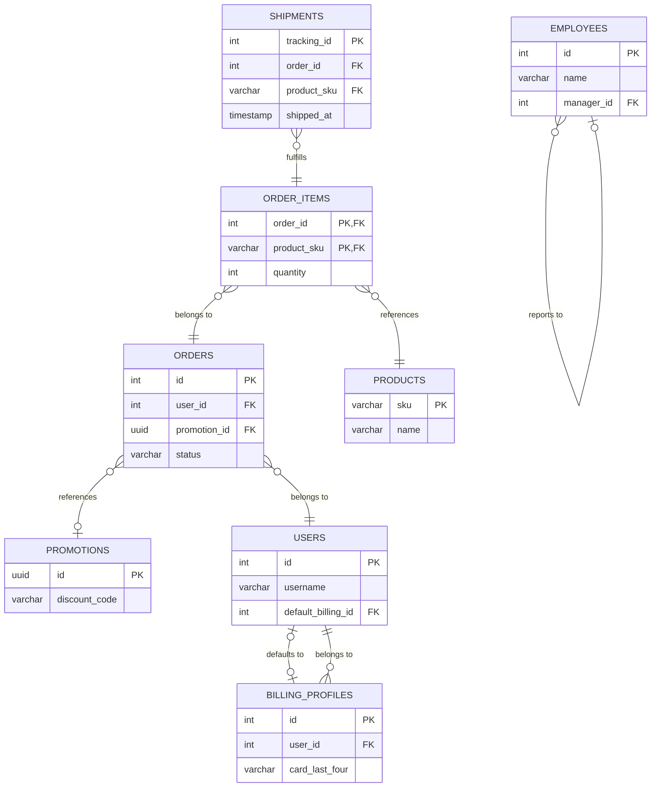

# Test schema
This relational database schema is specifically engineered to stress-test our 
graph traversal, cycle detection, and composite key handling.

| Table | Scenario Tested |
| --- | --- |
| `users` & `billing_profiles` | **Cross-table cycle.** If our deduplication logic fails, the `data-snapper` will infinitely loop extracting User 1 -> Billing 5 -> User 1. |
| `employees` | **Self-referential cycle.** Ensures the graph crawler doesn't crash when a table is its own parent. |
| `orders` | **Nullable FKs.** Your engine must know to ignore `NULL` values instead of pushing them into the queue. |
| `order_items` | **Composite PK.** Tests if your `HashSet` can store and deduplicate tuples `(Int, String)` instead of scalar IDs. |
| `shipments` | **Composite FK.** Tests if your `pg_catalog` SQL accurately maps multi-column foreign keys together as a single referential constraint. |

